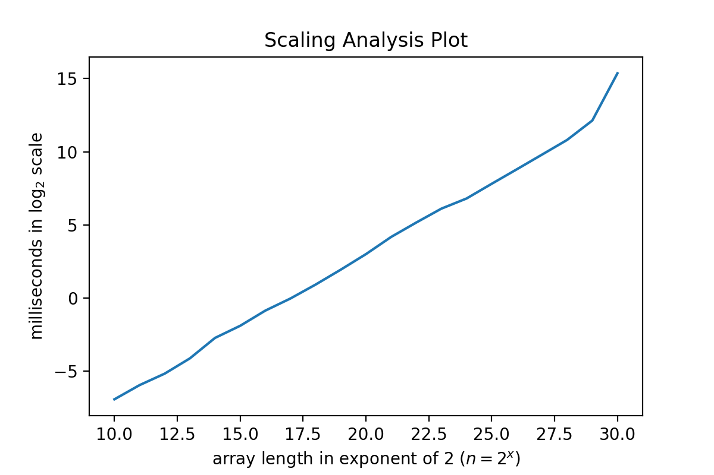

# Task 1
The scaling analysis plot is shown below:

From the figure, we can see that the scanning time is almost linear to the length of the scanned array.

# Task 3
## (f)
In my experiment, I found that the running time of `mmul2` < `mmul1` (8 x `mmul1`) < `mmul3` (2 x `mmul2`).

I think it is the cache locality that affects the speed of execution. As we store the 2D matrix in row-major, it means that consecutive elements of a row reside next to others in the memory, but elements in a column do not.

When we are processing data, it is loaded into the cache from the RAM, and each time cache memory reads one cache line of data from the RAM, which is larger than one `double` data type. The previously accessed cache lines are stored in the cache memory, so if we read the data continuedly from a row rather than a column, we can increase the probability of the cache hit, which allows for faster data access.

For the running time of `mmul4`, it is almost the same as `mmul1`. This is because the `std::vector` is a contiguous container since C++17. It means that the container stores elements in contiguous memory locations, which shares a similar spatial locality as the built-in array in C++.